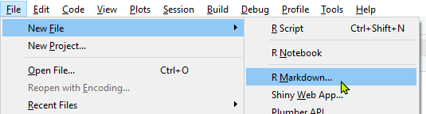
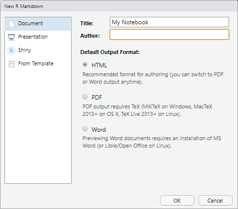
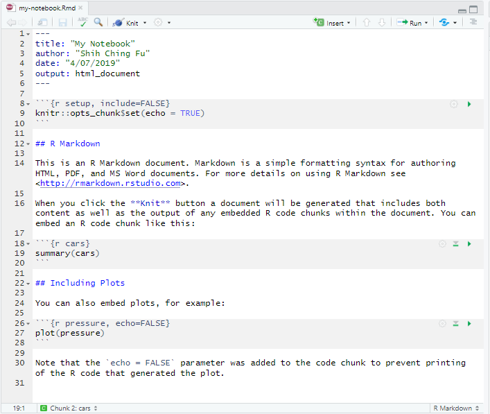
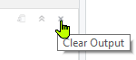

```{r setup, include=FALSE}
library(knitr)
data("iris")
```

# Welcome

During this session you'll get a brief introduction to R Markdown. You'll learn about the basic building blocks of an R Markdown file and learn how to knit an HTML notebook using RStudio[^rstudio].

[^rstudio]: RStudio, https://www.rstudio.com/


## Learning Objectives

The only pre-requisite is having R and RStudio installed on your computer since the needed packages are installed by default. You don’t really need to know much R programming to produce professionally marked up documents.

After completing this lesson you should be able to:

1. Create and edit an R Notebook from scratch in RStudio.

2. Knit an R Notebook containing commonly used R Markdown commands into an HTML document.

3. Know where to get further information on more advanced R Markdown usage.


## Source materials

The materials for this lesson are derived heavily from the following sources which are excellent resources in their own right:

* [R for Data Science](https://r4ds.had.co.nz/) [@grolemund2017RScience] 

* [R for Reproducible Scientific Analysis](http://swcarpentry.github.io/r-novice-gapminder/) [@wright2016RAnalysis]

* [R Markdown: The Definitive Guide](https://bookdown.org/yihui/rmarkdown/) [@xie2018RGuide]

* [R Markdown](https://rmarkdown.rstudio.com/lesson-1.html) [@rmarkdown]


## Why use R Markdown?

As an analyst you'll regularly prepare reports to document your methods and communicate your findings. And these reports will likely contain a mixture of worded explanations, tables of data, and graphical figures. R Markdown, via the `knitr`[^knitr] package, allows you to embed code into documents so that results such as graphs and figures may be interleaved directly amongst explanatory text in the one source file. Should you wish to change some text or fix an error, at the click of a button you could recompile a new `.HTML`, `.PDF`, or `.DOCX` report.

Aside from the convenience of not needing to copy-paste between different source documents, your R Notebook fully encapulates your work and is easily shareable as reproducible research [@peng2014TheImportant]. By sharing your R Notebook with collaborators or colleagues (or sceptics) they could take your data, code, and text, and reproduce the exact same analysis as you conducted.

[^knitr]: knitr, http://yihui.name/knitr/

According to @grolemund2017RScience, R Markdown files are designed for use in three ways:

1. Communicating to decision makers who focus on conclusions rather than the code behind the analysis.

2. Collaborating with other analysts who are interested in both your conclusions and how you reached them.

3. As an environment in which to do analysis, as a modern day lab notebook where you can capture both what you did and what you were thinking at the time.


# R Notebook Usage

## Creating an R Notebook

RStudio includes all that you need to get started with creating an R Notebook. The steps below create a new (HTML) notebook with file extension `.Rmd` which RStudio populates with some basic R Markdown content.

1. Launch RStudio

2. Click *File* menu

3. Click *New File* $\blacktriangleright$ *R Markdown...*

   

4. Choose *Document* from the list and enter "My Notebook" and your name into the *Title* and *Author* fields respectively.

   

5. Leave the *Default Output Format* as HTML and click *OK*.

You can already see that R Markdown can be processed into various output types and formats, e.g., PDF Document, HTML slide presentation.

<p><div class="boxed" style="background-color: #eec27510; padding: 10px; border: 1px solid #eec275">
**Exercise 1**

1. Create a new RStudio project called `my-project`.

2. Create a new R Notebook entitled "My Notebook" with a *Default Output Format* of HTML.

3. Save the notebook as `my-notebook.Rmd`.

   

4. Identify the YAML header, formatted text, and any 'code chunks'.

</div></p>

## Structure of `.Rmd` files

From the exercise above, you'll have observed that an R Markdown `.Rmd` file has three components. We shall go into more details later but briefly,

+ **Formatted text**

  Prose related to the presented analysis and results.

+ **Code chunks**

  Executable R code producing outputs for embedding into the final document.

+ **YAML header**

  Settings related to the generation of the final output document.


## Running R code chunks

Run a code chunk by clicking the *Run Current Chunk* button within the chunk or by placing your cursor inside it and pressing *Ctrl + Shift + Enter*.


The output of the code chunk is displayed within the notebook inside the editor pane.

You can clear this output but clicking on the small cross icon found in the top right corner of the chunk output. There are also icons to pop-out its own window or hide it inline.



## Knitting an R Notebook

'Knitting' an R Notebook refers to compiling it into an output document.

When you knit an R Notebook the `.Rmd` file is sent to `knitr` which executes any code chunks and creates an intermediate Markdown `.md` document. This `.md` file, containing both the code and its output, is processed by `pandoc`[^pandoc] into the finished file. 

[^pandoc]: pandoc, http://pandoc.org/


The advantage of this two-step workflow is that you can create a wide range of output formats from the same `.Rmd` file. For example, slide presentations, dashboards, websites, and webapps.

To knit a notebook in RStudio, click the *Knit* button found in the toolbar of the source editor pane, or use the keyboard shortcut *Ctrl + Shift + K*.


A preview of the knitted document will appear in its own window (or depending on your RStudio settings, in the *Viewer* pane). 

Set your preferred preview location by clicking the white cog button and choosing *Preview in Window* or *Preview in Viewer Pane*.


### Previewing an HTML *Notebook* {-}

If the output type specified in the YAML header is `html_notebook` (rather than `html_document` as above) a *Preview Notebook* button appears instead of a *Knit* button. *Preview Notebook* shows you a rendered HTML copy of the contents of the editor without first executing any R code. It only renders whatever results are already shown in the editor pane.

<p><div class="boxed" style="background-color: #eec27510; padding: 10px; border: 1px solid #eec275">
**Exercise 2**

1. Knit to HTML the notebook `my-notebook.Rmd` that you created in Exercise 1.

2. Observe the correspondence between the R Markdown and the resultant document. In particular the R code embedded in 'code chunks' (discussed later).

3. Make some changes to the `.Rmd` file and re-knit the document, e.g., delete some text, add `head(cars)` or `str(cars)` to the existing code chunk.

4. Confirm that you see your changes reflected in the finished document.

TIP: Use the keyboard shortcut *Ctrl + Shift + K* to save and knit a notebook in a single action.

</div></p>


# R Markdown Syntax

## Formatted Text

Text in `.Rmd` files is written in Pandoc's Markdown whose syntax is designed to be human-readable and suggestive of its final HTML rendering. The styled text must be enclosed by a special character. 
Below are the most common styles you'll be using in R Notebooks.

### Headings

Headings are specified using hash `#` prefixes.

~~~
# Level 1 heading
~~~

~~~
## Level 2 heading
~~~

~~~
### Level 3 heading
~~~

### Inline text styles

*Italic* styling is done with single asterisks or underscores: `*italic*` or `_italic_`

**Bold** styling is done with double asterisks or underscores: `**bold**` or  `__bold__`

***Bold & italic*** styling is done with triple asterisks or underscores: `***bold & italic***` or  `___bold & italic___`

`Inline code` styling is done with single backticks: `` `plot(iris)` ``

S^uperscripting^ is done with carets: `S^uperscripting^`

S~ubscripting~ is done with tildes: `S~ubscripting~`

~~Strikethrough~~ is done with double tildes: `~~Strikethrough~~`

### $\LaTeX$ equations

Surrounding an expression with dollar symbols `$` will make R Markdown interpret it as in-line $\LaTeX$ formatting. 

~~~
Sum of negative integer powers of 2 is $\sum_{n=1}^{\infty} 2^{-n} = 1$
~~~

<p><div class="boxed" style="background-color: #0000EE05; padding: 10px; border: 1px solid blue">
Output:

Sum of negative integer powers of 2 is $\sum_{n=1}^{\infty} 2^{-n} = 1$
</div></p>


Using double dollar symbols `$$` will centre the equation on its own line. 

~~~
Sum of negative integer powers of 2 is $$\sum_{n=1}^{\infty} 2^{-n} = 1$$
~~~

<p><div class="boxed" style="background-color: #0000EE05; padding: 10px; border: 1px solid blue">
Output:

Sum of negative integer powers of 2 is $$\sum_{n=1}^{\infty} 2^{-n} = 1$$
</div></p>

### Links

Clickable URLs are inserted by enclosing the URL in greater-than `<` and less-than `>` symbols. 

~~~
<http://example.com>
~~~

<p><div class="boxed" style="background-color: #0000EE05; padding: 10px; border: 1px solid blue">
Output:

<http://example.com>

</div></p>

Custom anchor text is enclosed in square parentheses `[]` followed by the URL in round parentheses `()`.

~~~
[hypertext link](http://example.com)
~~~

<p><div class="boxed" style="background-color: #0000EE05; padding: 10px; border: 1px solid blue">
Output:

[hypertext link](http://example.com)
</div></p>

### Footnotes

You can insert hyperlinked footnotes using square bracket and caret syntax `[^noteID]`. The note ID can be any string of characters without spaces. 

The numbering of footnotes is done automatically upon knitting.

~~~
Statisticians use the AIC[^aic] to evaluate relative quality between models.
~~~

<p><div class="boxed" style="background-color: #0000EE05; padding: 10px; border: 1px solid blue">
Output:

Statisticians use the AIC[^aic] to evaluate relative quality between models.

</div></p>

The definition of the footnote must appear in the R Notebook somewhere _after_ it is first mentioned in the text. Notice the colon `:` in the syntax.

~~~
[^aic]: AIC stands for Akaike Information Criterion
~~~

[^aic]: AIC stands for Akaike Information Criterion

The footnote itself appears at the end of the HTML document with a convenient hyperlink back to where it appears in the document body.

### Images
 
Images are inserted by providing a file path to the image, either a link to a locally stored file or a URL to an image hosted online. Notice the leading exclamation mark `!` and caption in square parentheses `[]`. Leave the square parentheses empty for no caption.

~~~

~~~

<p><div class="boxed" style="background-color: #0000EE05; padding: 10px; border: 1px solid blue">
Output:


</div></p>

### Unordered Lists

Items of an unordered list are prefixed with an asterisk `*`, hyphen `-`, or plus `+`. Extra carriage returns inserts space between bullet points and nest a bullet point by inserting four blank spaces before it.

~~~
* An item

* Another item
    * Nested item
    * Another nested item
~~~

<p><div class="boxed" style="background-color: #0000EE05; padding: 10px; border: 1px solid blue">
Output:

* An item

* Another item
    * Nested item
    * Another nested item

</div></p>

### Ordered Lists

Ordered lists are prefixed with numbers or letters. 

Notice that the numbering is incremented automatically in the output even if typed out of order.

~~~
1. First item
2. Second item
    a. First nested item
    
    a. Second nested item
    
1. Third item
~~~

<p><div class="boxed" style="background-color: #0000EE05; padding: 10px; border: 1px solid blue">
Output:

1. First item
2. Second item
    a. First nested item
    
    a. Second nested item
    
1. Third item

</div></p>

### Block quotations

Block quotations are created by prefixing each line with the greater-than symbol `<`.

~~~
> First level of quoting
>
> > Nested block quotation
>
> Back to the first level
~~~

<p><div class="boxed" style="background-color: #0000EE05; padding: 10px; border: 1px solid blue">
Output:

> First level of quoting
>
> > Nested block quotation
>
> Back to the first level

</div></p>

### Tables

Manually create a static table using hyphens `-` and pipes `|` to indicate a header row and columns respectively. Rows are ended with a carriage return.

~~~
First Header  | Second Header | Third Header
------------- | ------------- | ------------
Cell content  | Cell content  | Cell content
Cell content  | Cell content  | Cell content
~~~

<p><div class="boxed" style="background-color: #0000EE05; padding: 10px; border: 1px solid blue">
Output:

First Header  | Second Header | Third Header
------------- | ------------- | ------------
Cell content  | Cell content  | Cell content
Cell content  | Cell content  | Cell content

</div></p>

#### Tabular code output {-}

If the output of a code chunk is a table of values, R Markdown will render it accordingly.

````
```{r}`r ''`
head(iris)
```
````
<p><div class="boxed" style="background-color: #0000EE05; padding: 10px; border: 1px solid blue">
Output:

```{r}
head(iris)
```

</div></p>

To get nicer looking tables we can use the `kable()` function from the `knitr` package.

````
```{r}`r ''`
kable(head(iris))
```
````

<p><div class="boxed" style="background-color: #0000EE05; padding: 10px; border: 1px solid blue">
Output:

```{r}
kable(head(iris))
```

</div></p>

### Horizontal rules

Horizontal rules are inserted using three or more consecutive asterisks `*` (or hyphens `-`).

~~~
---
~~~

<p><div class="boxed" style="background-color: #0000EE05; padding: 10px; border: 1px solid blue">
Output:

---

</div></p>

<p><div class="boxed" style="background-color: #eec27510; padding: 10px; border: 1px solid #eec275">
**Exercise 3**

Remember to re-knit the notebook to see your changes.

1. Put a horizontal rule underneath the content in your R notebook from Exercise 2 (`my-notebook.Rmd`).

2. Below the rule insert a heading called "Table of Contents"

3. Under the heading, use an ordered list with nesting to create the outline of a typical scientific report, e.g., Introduction, Data Description, Methodology, etc.

   NOTE: You'll learn how to insert an autogenerated Table of Contents later.

4. Format some of the list items using the text styles mentioned above.

5. Insert a footnote into your notebook and include in its body a link to the [ResBaz Perth 2019](https://resbaz.github.io/resbaz2019/perth/) homepage.

</div></p>

<p><div class="boxed" style="background-color: #eec27510; padding: 10px; border: 1px solid #eec275">
**Exercise 4 (Optional)**

1. Use $\LaTeX$ syntax to add to your notebook the equation for Pythagoras' theorem or Euler's identity.

</div></p>

## Code Chunks

Code is inserted into R Notebooks in 'code chunks'. Upon knitting, these chunks are executed and their results inserted directly into the finished document. Embedding code alongside prose annotations of your methods and results speaks to the ethos of reproducible research.

Code chunks are enclosed by three backticks `` ``` `` followed by curly parentheses `{}` containing various parameters for that chunk. 


````
```{r Structure of iris dataset}`r ''`
str(iris)
```
````

In this example the first parameter `r` indicates that the chunk contains R code. `knitr` provides support for many other languages such as Bash, Perl, SQL, Python, and Julia. 

After the `r` is an optional name for this chunk. This helps with finding the chunk in the code navigator found in the bottom left of the editor pane.


The knitted notebook will therefore include both the code and its output one after the other.

<p><div class="boxed" style="background-color: #0000EE05; padding: 10px; border: 1px solid blue">
Output:

```{r Structure of iris dataset}
str(iris)
```

</div></p>

<p><div class="boxed" style="background-color: #eec27510; padding: 10px; border: 1px solid #eec275">
**Exercise 5**

1. Add a new R chunk by clicking in your notebook where you want to insert the chunk and clicking the *Insert* button on the toolbar. Alternatively (and preferably) use the *Ctrl + Alt + I* keyboard shortcut.
   
   

2. Name this chunk "summary iris" and confirm that name appears in the code chunk navigation menu.

3. Add this R code into the chunk: `summary(iris)`.

4. Run the chunk by clicking the *Run Current Chunk* button or by pressing *Ctrl + Shift + Enter*. 
   
   

4. Insert and run a couple more code chunks with R code of your choosing. 

5. Knit your notebook to HTML and check that the output is as you expect.

</div></p>

### Chunk options

You can specify in the curly parentheses `{}` further options that affect how a chunk is knitted into the final document. Only a few common examples are show below.

See <https://yihui.name/knitr/options> for a full list of options.

*a) Show the code and the output (default)*

````
```{r}`r ''`
colMeans(iris[,-5])
```
````

<p><div class="boxed" style="background-color: #0000EE05; padding: 10px; border: 1px solid blue">
Output:

```{r}
colMeans(iris[,-5])
```

</div></p>

*b) Show the code but don't execute it*

````
```{r, eval=FALSE}`r ''`
colMeans(iris[,-5])
```
````

<p><div class="boxed" style="background-color: #0000EE05; padding: 10px; border: 1px solid blue">
Output:

```{r, eval=FALSE}
colMeans(iris[,-5])
```

</div></p>

*c) Show the output but don't show the code*

````
```{r, echo=FALSE}`r ''`
colMeans(iris[,-5])
```
````

<p><div class="boxed" style="background-color: #0000EE05; padding: 10px; border: 1px solid blue">
Output:

```{r, echo=FALSE}
colMeans(iris[,-5])
```

</div></p>

*d) Execute the code but show anything*

````
```{r, include=FALSE}`r ''`
colMeans(iris[,-5])
```
````

<p><div class="boxed" style="background-color: #0000EE05; padding: 10px; border: 1px solid blue">
Output:

```{r, include=FALSE}
colMeans(iris[,-5])
```

</div></p>

### The setup chunk {-}

A special code chunk is one named *setup*. The setup chunk is automatically run just before you run another code chunk. It is useful for loading libraries and other data before proceeding with further analysis. 

The `include=FALSE` option prevents the setup chunk from inserting any output into the knitted document.

````
```{r setup, include=FALSE} `r ''`
library(knitr)
data("iris")
```
````

<p><div class="boxed" style="background-color: #eec27510; padding: 10px; border: 1px solid #eec275">
**Exercise 6**

1. Duplicate (copy/paste) the code chunk from Exercise 4 but specify a different output option from amongst those mentioned above. Observe the different output in the knitted document.

   HINT: instead of manually typing in the output options, RStudio provides a shortcut by clicking the cog icon found in the top right corner of the chunk, near to the *Run Current Chunk* button. 

   

   In the popup is also a [*Chunk options*](https://yihui.name/knitr/options/) link to the online documentation.

2. Repeat this exercise for the other output options, observing their effect on the knitted output.

</div></p>

### Inline R code

R code can be embedded inline by surrounding it in backticks `` ` `` and inserting a single `r` character prefix. This code is executed and replaced with its output when the notebook is knitted.

~~~
The `iris` dataset has ``r 'r nrow(iris)'`` rows.
~~~

<p><div class="boxed" style="background-color: #0000EE05; padding: 10px; border: 1px solid blue">
Output:

The `iris` dataset has `r nrow(iris)` rows.

</div></p>

### Figure options

All the aforementioned code chunks had only numerical outputs. Here is an example of a chunk that produces a figure, namely a boxplot of sepal widths from the `iris` dataset split by species.

````
```{r sepal width boxplot, echo=FALSE} `r ''`
boxplot(Sepal.Width ~ Species, data = iris, col = hcl.colors(3))
```
````

<p><div class="boxed" style="background-color: #0000EE05; padding: 10px; border: 1px solid blue">
Output:

```{r sepal width boxplot, echo=FALSE}
boxplot(Sepal.Width ~ Species, data = iris, col = hcl.colors(3), main="Iris sepal widths")
```

</div></p>

We can resize and align the plot using the `fig.height` and `fig.width` chunk options.

````
```{r sepal width boxplot echo=FALSE, fig.height=4, fig.width=4} `r ''`
boxplot(Sepal.Width ~ Species, data = iris, col = hcl.colors(3))
```
````

<p><div class="boxed" style="background-color: #0000EE05; padding: 10px; border: 1px solid blue">
Output:

```{r echo=FALSE, fig.height=4, fig.width=4}
boxplot(Sepal.Width ~ Species, data = iris, col = hcl.colors(3), main="Iris sepal widths")
```

</div></p>

Other useful options include:

* `fig.asp`: set aspect ratio
* `fig.dim`: specify height and width as a tuple
* `fig.align`: align figure to left, right, or centre of page

See <https://yihui.name/knitr/options/#plots> for an extensive list.

## YAML Header

At the top of a `.Rmd` file is the YAML[^yaml] header enclosed by triple hyphens `---`. It specifies settings that affect the entire document, in particular the output type.

[^yaml]: YAML stands for Yet Another Markup Language

Below is the default YAML header inserted by RStudio which sets a R Markdown file to knit to an HTML notebook.

~~~
---
title: "R Notebook"
output: html_notebook
---
~~~

Other document output types include  PDF, Word, and HTML documents (distinct from HTML *notebook*). Note that PDF output requires $\LaTeX$ to be installed and Word output requires Microsoft Word (or equivalent) for previewing.

~~~
---
title: "R Document"
output:
  pdf_document: default
  word_document: default
  html_document: default
---
~~~

Alternatively, you can produce a slideshow using `beamer`, `ioslides`, or `slidy` as the output parameter.

~~~
---
title: "R Slideshow"
output:
  beamer_presentation: default
  ioslides_presentation: default
  slidy_presentation: default
---
~~~

### HTML document settings {-}

For this lesson we have focussed on knitting HTML documents (`html_document` output type). There are many settings available as illustrated by the YAML header used in the `.Rmd` file for this lesson:

~~~
---
title: "Introduction to R Markdown"
author: "[Shih Ching Fu](mailto:shih.ching.fu@gmail.com)"
date: "ResBaz Perth 2019"
output:
  html_document:
    toc: true
    toc_depth: 3
    toc_float: 
      collapsed: true
      smooth_scroll: true
    number_sections: true
    theme: readable
    highlight: haddock
    fig_width: 7
    fig_height: 6
    fig_caption: true
    code_folding: show
bibliography: ref.bib
---
~~~

See Part II of @xie2018RGuide for full details of the options for various output types.

## Bibliographies

R Markdown supports common bibliography formats such as BibTeX, BibLaTeX, and EndNote. The path to the bibliography file must be specified in the YAML header under the `bibliography` field.

~~~
---
title: "Introduction to R Markdown"
author: "Shih Ching Fu"
date: "ResBaz Perth 2019"
output:
  html_document
bibliography: ref.bib
---
~~~

In-text citations are inserted using the at sign `@` followed by the citation key. 

~~~
Part II of @xie2018RGuide describes the various output formats available with R Markdown.`
~~~

<p><div class="boxed" style="background-color: #0000EE05; padding: 10px; border: 1px solid blue">
Output:

Part II of @xie2018RGuide describes the various output formats available with R Markdown.

</div></p>

# Just the beginning...

There is ***much*** more to R Markdown than what's covered here and really the only way to become familiar is by practising your knitting.

The sources mentioned in the bibliography below are a good starting point for further exploration. And a simple Google search turns up example galleries like this <https://yihui.name/knitr/demo/showcase/>.

# Bibliography

