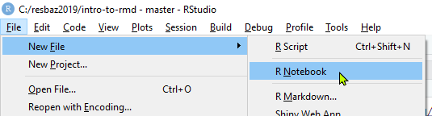

```{r setup, include=FALSE}
library(knitr)
data("iris")
```

# Welcome #

During this session you'll get a brief introduction to R Markdown. You'll learn about the basic building blocks of an R Markdown file and learn how to knit one into an HTML notebook using RStudio[^1].

[^1]: RStudio, https://www.rstudio.com/

## Learning Objectives ##

The only pre-requisite is having R and RStudio installed on your computer since the needed packages are installed by default. You don’t even need to know much R programming!

After completing this lesson you should be able to:

1. Create and edit an R Notebook from scratch in RStudio.

2. Knit an R Notebook containing commonly used R Markdown commands into an HTML document.

3. Know where to get further information on more advanced R Markdown usage.

## Source materials ##

The materials for this lesson are derived heavily from the following sources which are excellent resources in their own right:

* [R for Data Science](https://r4ds.had.co.nz/) [@grolemund2017RScience] 

* [R for Reproducible Scientific Analysis](http://swcarpentry.github.io/r-novice-gapminder/) [@wright2016RAnalysis]

* [R Markdown: The Definitive Guide](https://bookdown.org/yihui/rmarkdown/) [@xie2018RGuide]

* [R Markdown](https://rmarkdown.rstudio.com/lesson-1.html) [@rmarkdown]


## Why use R Markdown? ##

As an analyst you'll forever be compiling reports to document your methods and findings. These reports will no doubt contain a mixture of word explanations, tables, and figures. From a productivity perspective wouldn't it be really efficient if you could draft your reports in a single electronic artefact rather than copying and pasting between numerous documents? Furthermore, from a reproducible research perspective wouldn't it be extremely valuable if collaborators or colleagues (or sceptics) could take your data, code, and text, and reproduce your exact same figures and results? Well, R Markdown helps with all of this.

R Markdown, via the `knitr`[^2] package, allows you to embed code into documents so that results such as graphs and figures may be interleaved directly amongst explanatory text. Should you wish to change some text or fix an error, a new document can be recompiled at the click of a button. Furthermore, these output documents may be in various file formats including `.HTML`, `.PDF`, `.DOCX`.

[^2]: knitr, http://yihui.name/knitr/

According to @grolemund2017RScience, R Markdown files are designed for use in three ways:

1. Communicating to decision makers, focusing on conclusions rather than the code behind the analysis.

2. Collaborating with other analysts who are interested in both your conclusions and how you reached them.

3. As an environment in which to do analysis, as a modern day lab notebook where you can capture not only what you did, but also what you were thinking at the time.

# R Notebook Basics #

## Creating an R Notebook ##

RStudio includes all that you need to get started with creating an R Notebook. The steps below create a new R Notebook with file extension `.Rmd` that RStudio populates with some basic R Markdown content.

1. Launch RStudio

2. Click *File* menu

3. Click *New File* $\blacktriangleright$ *R Notebook*

   

<p><div class="boxed"><div style="background-color: #eec27510; padding: 10px; border: 1px solid #eec275">
**Exercise 1**

1. Create a new RStudio project, call it `intro-to-rmd`.

2. Create a new R Notebook.

3. Save the notebook as `my-notebook.Rmd`.

4. Identify the YAML header, formatted text, and the 'code chunk'.

</div></p>

## Knitting an R Notebook ##

When you knit an R Notebook the `.Rmd` file is sent to `knitr` which executes any included R code and creates an intermediate Markdown `.md` document containing that code and its output. The `.md` file is then processed by `pandoc`[^3] which is responsible for creating the finished file. 

[^3]: pandoc, http://pandoc.org/


The advantage of this two step workflow is that you can create a wide range of output formats from the same `.Rmd` file. For example,  slide presentations, dashboards, websites, and webapps.

To knit a notebook in RStudio, click the *Knit* button found in the toolbar of the source editor pane, or use the keyboard shortcut *Ctrl + Shift + K*.


A preview of the knitted document will appear in its own window (or depending on settings, in the *Viewer* pane). You can specified your preferred preview location by clicking the white cog button and choosing *Preview in Window* or *Preview in Viewer Pane*.


If you are knitting to an HTML notebook, there is a *Preview Notebook* button instead of a *Knit* button. *Preview Notebook* shows you a rendered HTML copy of the contents of the editor but unlike *Knit*, *Preview Notebook* __does not__ run any R code. Instead it reuses the output from when the code was last executed.

<p><div class="boxed"><div style="background-color: #eec27510; padding: 10px; border: 1px solid #eec275">
**Exercise 2**

1. Knit to HTML the notebook `my-notebook.Rmd` that you created in Exercise 1.

2. Observe the correspondence between the R Markdown and the resultant document.

3. Make some changes to the `.Rmd` file and re-knit the document.

4. Confirm that you see your changes reflected in the finished document.

TIP: Use the keyboard shortcut *Ctrl + Shift + K* to save and knit the notebook in one action.

</div></p>


## Structure of an R Markdown file ##

An R Markdown `.Rmd` file has three components:

+ Formatted text

+ Code chunks

+ YAML header


# Formatted Text #

Text in `.Rmd` files is written in Pandoc's Markdown[^4] whose syntax is designed to be human-readable and suggestive of its final HTML rendering. The styled text must be pre- and suffixed by a special character. Below are the most common styles you'll be using in R Notebooks.

[^4]: Pandoc's Markdown, https://pandoc.org/MANUAL.html#pandocs-markdown

## Inline text styles ##

*Italic* styling is done with single asterisks or underscores: `*italic*` or `_italic_`

**Bold** styling is done with double asterisks or underscores: `**bold**` or  `__bold__`

***Bold & italic*** styling is done with triple asterisks or underscores: `***bold & italic***` or  `___bold & italic___`

`Inline code` styling is done with single backticks: `` `plot(iris)` ``

S^uperscripting^ is done with carets: `S^uperscripting^`

S~ubscripting~ is done with tildes: `S~ubscripting~`

~~Strikethrough~~ is done with double tildes: `~~Strikethrough~~`

## $\LaTeX$ equations ##

Surrounding an expression with dollar symbols `$` will make R Markdown interpret it as in-line $\LaTeX$ formatting. 

~~~
$\sum_{n=1}^{\infty} 2^{-n} = 1$
~~~
<p><div class="boxed"><div style="background-color: #0000EE05; padding: 10px; border: 1px solid blue">
Output:

$\sum_{n=1}^{\infty} 2^{-n} = 1$
</div></p>


Using double dollar symbols `$$` will centre the equation on its own line. 

~~~
$$\sum_{n=1}^{\infty} 2^{-n} = 1$$
~~~

<p><div class="boxed"><div style="background-color: #0000EE05; padding: 10px; border: 1px solid blue">
Output:

$$\sum_{n=1}^{\infty} 2^{-n} = 1$$
</div></p>

## Headings ##

Headings are specified using hash `#` prefixes.

~~~
# Level 1 heading
~~~

~~~
## Level 2 heading
~~~

~~~
### Level 3 heading
~~~


## Unordered Lists ##

Items of an unordered list are prefixed with an asterisk `*`, hyphen `-`, or plus `+`. Inserting extra carriage returns spaces out the bullet points and tab stops nests bullet points.

~~~
* Item 1

* Item 2
    * Item 2a
    * Item 2b
~~~

<p><div class="boxed"><div style="background-color: #0000EE05; padding: 10px; border: 1px solid blue">
Output:

* Item 1

* Item 2
    * Item 2a
    * Item 2b

</div></p>

## Ordered Lists ##

Ordered lists are prefixed with numbers or letters. Notice that the numbering is incremented automatically in the output even if typed out of order.

~~~
1. First ordered list item
2. Second ordered list item
    a. First nested ordered list item
    
    a. Second nested ordered list item
    
1. Third ordered list item
~~~

<p><div class="boxed"><div style="background-color: #0000EE05; padding: 10px; border: 1px solid blue">
Output:

1. First ordered list item
2. Second ordered list item
    a. First nested ordered list item
    
    a. Second nested ordered list item
    
1. Third ordered list item

</div></p>

## Links ##

Clickable URLs are inserted by enclosing the URL in greater-than `<` and less-than `>` symbols. 

~~~
<http://example.com>
~~~

<p><div class="boxed"><div style="background-color: #0000EE05; padding: 10px; border: 1px solid blue">
Output:

<http://example.com>

</div></p>

Custom anchor text is enclosed in square parentheses `[]` followed by the URL in round parentheses `()`.

~~~
[hypertext link](http://example.com)
~~~

<p><div class="boxed"><div style="background-color: #0000EE05; padding: 10px; border: 1px solid blue">
Output:

[hypertext link](http://example.com)
</div></p>

## Footnotes ##

You can insert hyperlinked footnotes using square bracket and caret syntax `[^ ]`.

~~~
Statisticians use the AIC[^5] to evaluate relative quality between models.
~~~

<p><div class="boxed"><div style="background-color: #0000EE05; padding: 10px; border: 1px solid blue">
Output:

Statisticians use the AIC[^5] to evaluate relative quality between models.

</div></p>

The definition of the footnote must appear in the R Notebook someplace _after_ it is first mentioned in the text. Notice the colon `:` in the syntax.

~~~
[^5]: AIC stands for Akaike Information Criterion
~~~

[^5]: AIC stands for Akaike Information Criterion

The footnote itself appears at the end of the HTML document with a convenient hyperlink back to where it appears in the document body.

## Images ##
 
Images are inserted by providing a file path to the image, either a link to a locally stored file or a URL to an image hosted online. Notice the leading exclamation mark `!` and caption in square parentheses `[]`. Leave the square parentheses empty for no caption.

~~~

~~~

<p><div class="boxed"><div style="background-color: #0000EE05; padding: 10px; border: 1px solid blue">
Output:


</div></p>

## Tables ##

You can manually create a text table by using hyphens `-` and pipes `|` to insert horizontal grid-lines and delineate columns, respectively. Rows are ended with a carriage return. It is a bit tricky though!

~~~
First Header  | Second Header | Third Header
------------- | ------------- | ------------
Cell content  | Cell content  | Cell content
Cell content  | Cell content  | Cell content
~~~

<p><div class="boxed"><div style="background-color: #0000EE05; padding: 10px; border: 1px solid blue">
Output:

First Header  | Second Header | Third Header
------------- | ------------- | ------------
Cell content  | Cell content  | Cell content
Cell content  | Cell content  | Cell content

</div></p>

If the output of a code chunk is a table of values, R Markdown will render a table accordingly.

````
```{r}`r ''`
head(iris)
```
````
<p><div class="boxed"><div style="background-color: #0000EE05; padding: 10px; border: 1px solid blue">
Output:

```{r}
head(iris)
```

</div></p>

To get nicer looking tables we can use the `kable()` function from the `knitr` package.

````
```{r}`r ''`
kable(head(iris))
```
````

<p><div class="boxed"><div style="background-color: #0000EE05; padding: 10px; border: 1px solid blue">
Output:

```{r}
kable(head(iris))
```

</div></p>

## Block quotations ##

Block quotations are created by prefixing each line with the greater-than symbol `<`.

~~~
> First level of quoting
>
> > Nested block quote
>
> Back to the first level
~~~

<p><div class="boxed"><div style="background-color: #0000EE05; padding: 10px; border: 1px solid blue">
Output:

> First level of quoting
>
> > Nested block quote
>
> Back to the first level

</div></p>

## Horizontal rule ##

Horizontal rules are inserted using three or more consecutive asterisks `*` (or hyphens `-`).

~~~
---
~~~

<p><div class="boxed"><div style="background-color: #0000EE05; padding: 10px; border: 1px solid blue">
Output:

---

</div></p>

<p><div class="boxed"><div style="background-color: #eec27510; padding: 10px; border: 1px solid #eec275">
**Exercise 3**

1. Put a horizontal rule underneath the content in your R notebook from Exercise 2 (`my-notebook.Rmd`).

2. Below the rule insert a heading called "Table of Contents"

3. Under the heading, use an ordered list with nesting to create the outline of a typical scientific report, e.g., Introduction, Data Description, Methodology, etc.

   NOTE: You'll learn how to insert an autogenerated Table of Contents later.

4. Format some of the list items using the text styles mentioned above.

5. Insert a footnote into your notebook and include in its body a link to the [ResBaz Perth 2019](https://resbaz.github.io/resbaz2019/perth/) homepage.

</div></p>

<p><div class="boxed"><div style="background-color: #eec27510; padding: 10px; border: 1px solid #eec275">
**Exercise 4 (Optional)**

1. Use $\LaTeX$ syntax to add to your notebook the equation for Pythagoras' theorem or Euler's identity.

</div></p>

# Code Chunks #

Code is inserted into R Notebooks as 'code chunks'. Upon knitting, these chunks are executed and their results inserted directly into the finished document. Embedding code alongside prose annotations of your methods and results speaks to the ethos of reproducible research.

Code chunks are enclosed by three backticks `` ``` `` followed by curly parentheses `{}` containing various parameters for that chunk. 


````
```{r Structure of iris dataset}`r ''`
str(iris)
```
````

The first parameter `r` indicates that the chunk contains R code. `knitr` provides support for many other languages such as Bash, Perl, SQL, Python, and Julia. 

After the `r` is an optional name for this chunk. This helps with finding the chunk in the code navigator found in the bottom left of the editor pane.


The knitted notebook will therefore include both the code and its output one after the other.

<p><div class="boxed"><div style="background-color: #0000EE05; padding: 10px; border: 1px solid blue">
Output:

```{r Structure of iris dataset}
str(iris)
```

</div></p>

<p><div class="boxed"><div style="background-color: #eec27510; padding: 10px; border: 1px solid #eec275">
**Exercise 5**

1. Add a new R chunk by clicking in your notebook where you want to insert the chunk and clicking the *Insert* button on the toolbar. Alternatively (and preferably) use the *Ctrl + Alt + I* keyboard shortcut.
   
   

2. Add the following code into the chunk `summary(iris)`.

3. Run the chunk by clicking the *Run Current Chunk* button within the chunk or by placing your cursor inside it and pressing *Ctrl + Shift + Enter*. 
   
   

</div></p>

## Chunk options ##

Inside the curly parentheses `{}` that precede a code chunk we can specify options that affect how the results are knitted into the final document. We shall only cover a handful of options here and full documentation is found at <https://yihui.name/knitr/options>. 

*a) Show the code and the output*

````
```{r}`r ''`
colMeans(iris[,-5])
```
````

<p><div class="boxed"><div style="background-color: #0000EE05; padding: 10px; border: 1px solid blue">
Output:

```{r}
colMeans(iris[,-5])
```

</div></p>

*b) Show the code but don't execute it*

````
```{r, eval=FALSE}`r ''`
colMeans(iris[,-5])
```
````

<p><div class="boxed"><div style="background-color: #0000EE05; padding: 10px; border: 1px solid blue">
Output:

```{r, eval=FALSE}
colMeans(iris[,-5])
```

</div></p>

*c) Show the output but don't show the code*

````
```{r, echo=FALSE}`r ''`
colMeans(iris[,-5])
```
````

<p><div class="boxed"><div style="background-color: #0000EE05; padding: 10px; border: 1px solid blue">
Output:

```{r, echo=FALSE}
colMeans(iris[,-5])
```

</div></p>

*d) Execute the code but show anything*

````
```{r, include=FALSE}`r ''`
colMeans(iris[,-5])
```
````

<p><div class="boxed"><div style="background-color: #0000EE05; padding: 10px; border: 1px solid blue">
Output:

```{r, include=FALSE}
colMeans(iris[,-5])
```

</div></p>

### Setup Chunk

A special code chunk is one named the *setup* chunk. This named chunk is executed automatically whenever you execute another code chunk. It is useful for loading libraries and other data before proceeding with further analysis. 

Notice the `include=FALSE` chunk option which sets this code chunk to execute but not produce any output.

````
```{r setup, include=FALSE} `r ''`
library(knitr)
data("iris")
```
````

<p><div class="boxed"><div style="background-color: #eec27510; padding: 10px; border: 1px solid #eec275">
**Exercise 6**

1. Duplicate (copy/paste) the code chunk from Exercise 4 but specify a different output option from amongst those mentioned above. Observe the different output in the knitted document.

   HINT: instead of manually typing in the output options, RStudio provides a shortcut by clicking the cog icon found in the top right corner of the chunk, near to the *Run* button. 

   

   Notice the [*Chunk options*](https://yihui.name/knitr/options/) link to online documentation of the available options.

2. Repeat for the other output options and observe their effects on the knitted document.

</div></p>

## Inline R code ##

R code can be embedded inline with formatted text and be executed upon knitting.

```The `iris` dataset has `r
nrows(iris)` rows.```

<p><div class="boxed"><div style="background-color: #0000EE05; padding: 10px; border: 1px solid blue">
Output:

The `iris` dataset has `r nrow(iris)` rows.

</div></p>

## Figure options ##

All the aforementioned code chunks only had numerical outputs. Here is an example of a chunk that produces a boxplot of the iris dataset, split by species.

````
```{r sepal width boxplot, echo=FALSE}`r ''`
boxplot(Sepal.Width ~ Species, data = iris, col = hcl.colors(3))
```
````

<p><div class="boxed"><div style="background-color: #0000EE05; padding: 10px; border: 1px solid blue">
Output:

```{r sepal width boxplot, echo=FALSE}
boxplot(Sepal.Width ~ Species, data = iris, col = hcl.colors(3), main="Iris sepal widths")
```

</div></p>

We can resize and align the plot using the `fig.height`, `fig.width=`, and `fig.align` chunk options.

````
```{r echo=FALSE, fig.height=4, fig.width=4}`r `''`
boxplot(Sepal.Width ~ Species, data = iris, col = hcl.colors(3))
```
````

<p><div class="boxed"><div style="background-color: #0000EE05; padding: 10px; border: 1px solid blue">
Output:

```{r echo=FALSE, fig.height=4, fig.width=4}
boxplot(Sepal.Width ~ Species, data = iris, col = hcl.colors(3), main="Iris sepal widths")
```

</div></p>

Other useful options include:

* `fig.asp`: set aspect ratio
* `fig.dim`: specify height and width as a tuple
* `fig.align`: align figure to left, right, or centre of page


# YAML Header #

At the top of a `.Rmd` file is the YAML[^6] header enclosed by triple hyphens `---`. It specifies settings that affect the entire document, in particular the output type.

[^6]: YAML stands for Yet Another Markup Language

The default YAML header inserted by RStudio sets the R Markdown file to knit to an HTML notebook.

~~~
---
title: "R Notebook"
output: html_notebook
---
~~~

Other document output types include HTML document (distinct from HTML *notebook*), PDF, and Word. Note that PDF output requires $\LaTeX$ to be installed.

~~~
---
title: "R Notebook"
output:
  html_document: default
  pdf_document: default
  word_document: default
---
~~~

Alternatively, you can produce a slideshow using `beamer`, `ioslides`, or `slidy` as the output parameter.

~~~
---
title: "R Presentation"
output:
  beamer_presentation: default
  ioslides_presentation: default
  slidy_presentation: default
---
~~~

## HTML document settings ##

For this lesson we shall focus upon knitting HTML documents for which there are many settings that we can set in the YAML header. Here is the YAML header for the `.Rmd` file that produced this HTML document.

~~~
---
title: "Introduction to R Markdown"
author: "Shih Ching Fu"
date: "ResBaz Perth 2019"
output:
  html_document:
    toc: true
    toc_float: 
      collapsed: false
      smooth_scroll: true
    toc_depth: 2
    number_sections: true
    theme: united
    highlight: haddock
    fig_width: 7
    fig_height: 6
    fig_caption: true
    code_folding: show
bibliography: ref.bib
---
~~~


## Create a bibliography and citations ##

R Markdown supports citing from bibliographies in common format such as BibTeX, BibLaTeX, and EndNote. The path to the bibliography file must be specified in the YAML header against the `bibliography` field.

~~~
---
title: "Introduction to R Markdown"
author: "Shih Ching Fu"
date: "ResBaz Perth 2019"
output:
  html_document
bibliography: ref.bib
---
~~~

Citing a reference uses the `@` symbol. 

~~~
Part II of @xie2018RGuide describes the various output formats available with R Markdown.`
~~~

<p><div class="boxed"><div style="background-color: #0000EE05; padding: 10px; border: 1px solid blue">
Output:

Part II of @xie2018RGuide describes the various output formats available with R Markdown.

</div></p>

# Bibliography #

