```{r setup, include=FALSE}
library(knitr)
library(palmerpenguins)
```

# Welcome

During this session you'll get a brief introduction to R Markdown. You'll learn about the basic building blocks of an R Markdown file and learn how to knit an HTML notebook using RStudio[^rstudio].

[^rstudio]: RStudio, https://www.rstudio.com/

<center>
  
</center>


## Learning Objectives

The only pre-requisite is having R and RStudio installed on your computer since the needed packages are installed by default. You don’t need much R programming knowledge to produce professionally marked up documents.

After completing this lesson you should be able to:

1. Create and edit an R Notebook from scratch.

2. Knit an R Notebook containing commonly used R Markdown commands into an HTML document.

3. Know where to get further information on more advanced R Markdown usage.


## Source materials

The materials for this lesson are derived heavily from the following places which are excellent resources in their own right:

* [R for Data Science](https://r4ds.had.co.nz/) [@grolemund2017RScience] 

* [R for Reproducible Scientific Analysis](http://swcarpentry.github.io/r-novice-gapminder/) [@wright2016RAnalysis]

* [R Markdown: The Definitive Guide](https://bookdown.org/yihui/rmarkdown/) [@xie2018RGuide]

* [R Markdown](https://rmarkdown.rstudio.com/lesson-1.html) [@rmarkdown]

Some examples use the `penguins` dataset found in the `palmerpenguins` package [@palmerpenguins]:

```{r echo=TRUE, eval=FALSE}
install.packages("palmerpenguins")
library(palmerpenguins)
```


## Why use R Markdown?

As an analyst you'll regularly prepare reports to document your methods and communicate your findings. And these reports will likely contain a mixture of worded explanations, tables of data, and graphical figures. An R Markdown file, via the `knitr`[^knitr] package, allows you to embed code for generating graphs and figures amongst other explanatory text -- all within the one source file. Should you wish to change some text or fix an error you can at the click of a button you can recompile a new `.HTML`, `.PDF`, or `.DOCX` report immediately.

Aside from the convenience of avoiding copy-pasting between different source documents, an R Notebook fully encapsulates your work and is easily shareable as reproducible research [see @peng2014TheImportant for the distinction between reproducible and replicable]. By [sharing](https://github.com/shihchingfu/intro-to-rmd/blob/master/intro-to-rmd.Rmd) your R Notebook with collaborators or colleagues (sceptics?) they can take your data, code, and text, and reproduce the exact same analysis as you conducted.

[^knitr]: knitr, http://yihui.name/knitr/

<center>

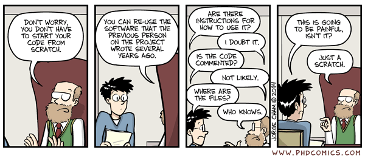

</center>

According to @grolemund2017RScience, R Markdown files are designed for use in three ways:

1. Communicating to decision makers who focus on conclusions rather than the code behind your analysis.

2. Collaborating with other analysts who are interested in *both* your conclusions and how you reached them.

3. As an environment in which to conduct analysis; a modern day lab notebook where you can capture both what you did and what you were thinking at the time.


# R Notebook Usage


## Creating an R Notebook

RStudio includes all that you need to get started with creating an R Notebook. The `rmarkdown`[^rmdpkg] package comes already installed. The steps below create a new (HTML) notebook with file extension `.Rmd` that's pre-filled with some basic R Markdown content.

[^rmdpkg]: rmarkdown, https://pkgs.rstudio.com/rmarkdown/index.html

1. Launch RStudio

2. (Recommended) Create a new project (*File*, *New Project...*, *New Directory* )

2. Click *File* menu

3. Click *New File* $\blacktriangleright$ *R Markdown...*

   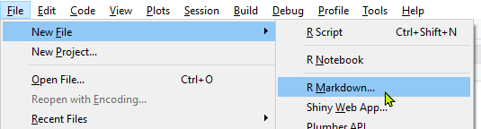

4. Choose *Document* from the list and enter "My Notebook" and your name into the *Title* and *Author* fields respectively.

   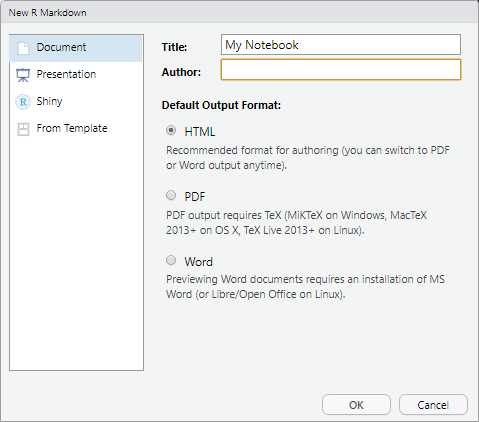

5. Leave the *Default Output Format* as *HTML* and click *OK*.

From the steps above you might notice that R Markdown can be processed into various output types and formats, e.g., PDF Document, HTML slide presentation.

<p><div class="boxed" style="background-color: #eec27510; padding: 10px; border: 1px solid #eec275">
**Exercise 1**

1. Create a new RStudio project called "my-project".

2. Create a new R Notebook entitled "My Notebook" with a *Default Output Format* of *HTML*.

3. Save the notebook as `my-notebook.Rmd`.

   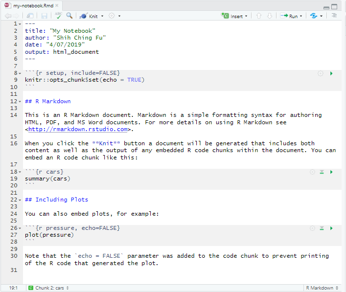

4. Identify the YAML header, formatted text, and any 'code chunks'.

</div></p>


## Structure of `.Rmd` files

From the exercise above you'll have observed the three typical components of an R Markdown `.Rmd` file, briefly:

+ **Formatted text**

  Prose related to the presented analysis and results.

+ **Code chunks**

  Executable R code producing outputs for embedding into the final document.

+ **YAML header**

  Settings related to the generation of the final output document.


## Running R code chunks

Run a code chunk by clicking the *Run Current Chunk* button (green arrow) within the chunk or (preferably) by placing the cursor inside the chunk and pressing <kbd>Ctrl</kbd> + <kbd>Shift</kbd> + <kbd>Enter</kbd>.

<center>
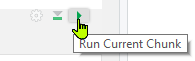
</center>

The output of the code chunk is displayed within the notebook inside the *Source* editor pane.

You can clear this output by clicking the *Clear Output* icon (small cross) found in the top right corner of the chunk output. You can also pop-out a separate output window or hide it altogether.

<center>
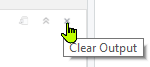
</center>


## Knitting an R Notebook

'Knitting' an R Notebook means to compile it into an output document.

When you knit an R Notebook the `.Rmd` file is sent to `knitr` which executes any code chunks and creates an intermediate Markdown `.md` document. This `.md` file contains both the code and its output and is processed by `pandoc`[^pandoc] into the finished file. 

[^pandoc]: pandoc, http://pandoc.org/

<center>


</center>

The advantage of this two-step workflow is being able to create a wide range of output formats from the same `.Rmd` file. For example, slide presentations, dashboards, websites, and web apps.

To knit a notebook in RStudio, click the *Knit* button found in the toolbar of the *Source* editor pane, or use the keyboard shortcut <kbd>Ctrl</kbd> + <kbd>Shift</kbd> + <kbd>K</kbd>.

<center>
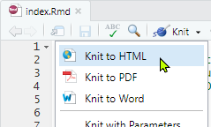
</center>

A preview of the knitted document will appear in its own window (or depending on your RStudio settings, in the *Viewer* pane). 

Set your preferred preview location by clicking the white cog button and choosing *Preview in Window* or *Preview in Viewer Pane*.

<center>
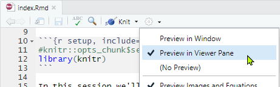
</center>
<br>

#### Previewing an HTML *Notebook* {-}

If the output type specified in the YAML header is `html_notebook` (rather than `html_document` as above) a *Preview Notebook* button appears instead of a *Knit* button. *Preview Notebook* shows you a rendered HTML copy of the contents of the *Source* editor pane without first executing any R code, i.e.,  it only renders whatever results are already shown in the pane.

<p><div class="boxed" style="background-color: #eec27510; padding: 10px; border: 1px solid #eec275">
**Exercise 2**

1. Knit to HTML the notebook `my-notebook.Rmd` that you created in Exercise 1.

2. Observe the correspondence between the R Markdown and the resultant document, particularly the R code embedded in the code chunks.

3. Make some changes to the `.Rmd` file and re-knit the document. Perhaps delete some text or add `head(cars)` or `str(cars)` to an existing code chunk.

4. Confirm that you can see the changes reflected in the re-knitted document.

TIP: Use the keyboard shortcut <kbd>Ctrl</kbd> + <kbd>Shift</kbd> + <kbd>K</kbd> to save and knit a notebook in a single action.

</div></p>


# R Markdown Syntax


## Formatted Text

Text in `.Rmd` files is written in `pandoc` R Markdown whose syntax is designed to be human-readable and suggestive of its final HTML rendering. In the examples below you'll see that styled text is usually enclosed by special characters. 


### Headings

Headings are defined using hash `#` characters. The more hashes, the less prominent the heading.

~~~
# Level 1 heading
~~~

~~~
## Level 2 heading
~~~

~~~
### Level 3 heading
~~~


### Inline text styles

*Italic* styling is applied using single asterisks or underscores: `*italic*` or `_italic_`

**Bold** styling is applied using double asterisks or underscores: `**bold**` or  `__bold__`

***Bold & italic*** styling is applied using triple asterisks or underscores: `***bold & italic***` or  `___bold & italic___`

`Inline code` styling is applied using backticks: `` `plot(penguins)` ``

S^uperscripting^ is applied using carets: `S^uperscripting^`

S~ubscripting~ is applied using tildes: `S~ubscripting~`

~~Strikethrough~~ is applied using double tildes: `~~Strikethrough~~`


### Inline R code

R code can be embedded inline by surrounding it in backticks `` ` `` and inserting a single `r` character prefix. This code is executed and replaced with its output when the notebook is knitted.

~~~
The `penguins` dataset has ``r 'r nrow(penguins)'`` rows.
~~~

<p><div class="boxed" style="background-color: #0000EE05; padding: 10px; border: 1px solid blue">
Output:

The `penguins` dataset has `r nrow(penguins)` rows.

</div></p>


### $\LaTeX$ equations

Surrounding an expression with dollar symbols `$` will have `knitr` interpret it as in-line $\LaTeX$ formatting. 

~~~
Sum of integer powers of a half is $\sum_{n=1}^{\infty} 2^{-n} = 1$
~~~

<p><div class="boxed" style="background-color: #0000EE05; padding: 10px; border: 1px solid blue">
Output:

Sum of integer powers of a half is $\sum_{n=1}^{\infty} 2^{-n} = 1$
</div></p>

Using double dollar symbols `$$` will centre the equation on its own line. 

~~~
Sum of integer powers of a half is $$\sum_{n=1}^{\infty} 2^{-n} = 1$$
~~~

<p><div class="boxed" style="background-color: #0000EE05; padding: 10px; border: 1px solid blue">
Output:

Sum of integer powers of a half is $$\sum_{n=1}^{\infty} 2^{-n} = 1$$
</div></p>


### Links

Clickable URLs are inserted by enclosing the URL in greater-than `<` and less-than `>` symbols. 

~~~
<http://example.com>
~~~

<p><div class="boxed" style="background-color: #0000EE05; padding: 10px; border: 1px solid blue">
Output:

<http://example.com>

</div></p>

Linked text is enclosed in square parentheses `[]` followed by the URL in round parentheses `()`.

~~~
[hypertext link](http://example.com)
~~~

<p><div class="boxed" style="background-color: #0000EE05; padding: 10px; border: 1px solid blue">
Output:

[hypertext link](http://example.com)
</div></p>


### Footnotes

You can insert hyperlinked footnotes using square bracket and caret syntax `[^footnoteID]`. The footnote ID can be any string of characters without spaces. 

The numbering of footnotes is done automatically upon knitting.

~~~
AIC[^aic] is used to evaluate the relative quality of models.
~~~

<p><div class="boxed" style="background-color: #0000EE05; padding: 10px; border: 1px solid blue">
Output:

AIC[^aic] is used to evaluate the relative quality of models.

</div></p>

The definition of the footnote must appear in the R Notebook somewhere _after_ it is first mentioned in the text. Notice the colon `:` in the syntax.

~~~
[^aic]: AIC stands for Akaike Information Criterion.
~~~

[^aic]: AIC stands for Akaike Information Criterion.

The footnote itself appears at the end of the HTML document with a convenient hyperlink back to where it appears in the document.


### Images
 
Images are inserted by providing a file path to the image, either a link to a locally stored file or a URL to an image hosted online. Notice the leading exclamation mark `!` and caption in square parentheses `[]`. Leave the square parentheses empty for no caption.

~~~
](https://imgs.xkcd.com/comics/purity.png)
~~~

<p><div class="boxed" style="background-color: #0000EE05; padding: 10px; border: 1px solid blue">
Output:

](./img/purity.png)

</div></p>


### Unordered Lists

Items of an unordered list are prefixed with an asterisk `*`, hyphen `-`, or plus `+`. Increase the line spacing between bullet points by adding extra carriage returns and nest bullet points by prepending four blank spaces.

~~~
* An item

* Another item
    * Nested item
    * Another nested item
~~~

<p><div class="boxed" style="background-color: #0000EE05; padding: 10px; border: 1px solid blue">
Output:

* An item

* Another item
    * Nested item
    * Another nested item

</div></p>


### Ordered Lists

Ordered lists are prefixed with numbers or letters. 

Notice that the numbering is incremented automatically in the output even if typed out of order.

~~~
1. First item
2. Second item
    a. First nested item
    
    a. Second nested item
    
1. Third item
~~~

<p><div class="boxed" style="background-color: #0000EE05; padding: 10px; border: 1px solid blue">
Output:

1. First item
2. Second item
    a. First nested item
    
    a. Second nested item
    
1. Third item

</div></p>


### Block quotations

Block quotations are created by prefixing each line with the greater-than symbol `>`.

~~~
> First level of quoting
>
> > Nested block quotation
>
> Back to the first level
~~~

<p><div class="boxed" style="background-color: #0000EE05; padding: 10px; border: 1px solid blue">
Output:

> First level of quoting
>
> > Nested block quotation
>
> Back to the first level

</div></p>


### Tables

Manually create a static table using hyphens `-` and pipes `|` to indicate the header row and columns respectively. Rows are terminated by a carriage return.

~~~
First Header  | Second Header | Third Header
------------- | ------------- | ------------
Cell content  | Cell content  | Cell content
Cell content  | Cell content  | Cell content
~~~

<p><div class="boxed" style="background-color: #0000EE05; padding: 10px; border: 1px solid blue">
Output:

First Header  | Second Header | Third Header
------------- | ------------- | ------------
Cell content  | Cell content  | Cell content
Cell content  | Cell content  | Cell content

</div></p>


#### Tabular code output {-}

If the output of a code chunk is a table of values, R Markdown will render it accordingly.

````
```{r}`r ''`
head(penguins)
```
````
<p><div class="boxed" style="background-color: #0000EE05; padding: 10px; border: 1px solid blue">
Output:

```{r}
head(penguins)
```

</div></p>

To get nicer looking tables we can use the `kable()` function from the `knitr` package.

````
```{r}`r ''`
kable(head(penguins))
```
````

<p><div class="boxed" style="background-color: #0000EE05; padding: 10px; border: 1px solid blue">
Output:

```{r}
kable(head(penguins))
```

</div></p>


### Horizontal rules

Horizontal rules are inserted using three or more consecutive asterisks `*` or hyphens `-`.

~~~
---
~~~

<p><div class="boxed" style="background-color: #0000EE05; padding: 10px; border: 1px solid blue">
Output:

---

</div></p>

<p><div class="boxed" style="background-color: #eec27510; padding: 10px; border: 1px solid #eec275">
**Exercise 3**

Remember to __re-knit__ the notebook to see your changes.

1. Put a horizontal rule underneath the content in your R notebook from Exercise 2 (`my-notebook.Rmd`).

2. Below the horizontal rule insert some text with inline R code, e.g., `` Mean bill length is `r
mean(penguins$bill_length_mm)` ``

2. Insert a heading called "Table of Contents"

3. Under the heading, use an ordered list with nesting to create the outline of a typical scientific report, e.g., Introduction, Data Description, Methodology, etc.

   You'll see how to insert a nicer, autogenerated Table of Contents later.

4. Format some of the list items using the text styles mentioned above.

5. Insert a footnote into your notebook and include in its body a link to RStudio's [RMarkdown tutorial](https://rmarkdown.rstudio.com/lesson-1.html).

</div></p>

<p><div class="boxed" style="background-color: #eec27510; padding: 10px; border: 1px solid #eec275">
**Exercise 4 (Optional)**

1. Use $\LaTeX$ syntax to insert Pythagoras' theorem or Euler's identity into your notebook.

</div></p>


## Code Chunks

Code is inserted into R Notebooks in 'code chunks'. Upon knitting, these chunks are executed and their results inserted directly into the finished document. Embedding code alongside prose annotations of your methods and results speaks to the ethos of reproducible research.

Code chunks are enclosed by three backticks `` ``` `` with a prefix of curly parentheses `{}` containing parameters for that chunk (if any). 

````
```{r Structure of penguins dataset}`r ''`
str(penguins)
```
````

In the above example the first parameter `r` indicates that the chunk contains R code. `knitr` provides support for many other languages such as Bash, Perl, SQL, Python, and Julia.

After the `r` is an optional name for this chunk. This helps with finding the chunk in the code navigator found in the bottom left of the *Source* editor pane.

<center>
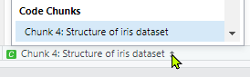
</center>

The knitted notebook will therefore include both the code and its output one after the other.

<p><div class="boxed" style="background-color: #0000EE05; padding: 10px; border: 1px solid blue">
Output:

```{r Structure of penguins dataset}
str(penguins)
```

</div></p>

<p><div class="boxed" style="background-color: #eec27510; padding: 10px; border: 1px solid #eec275">
**Exercise 5**

1. Add a new R chunk by clicking in your notebook where you want to insert the chunk and clicking the *Insert* button on the toolbar. 

   Alternatively use the <kbd>Ctrl</kbd> + <kbd>Shift</kbd> + <kbd>I</kbd> keyboard shortcut.
   
   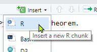

2. Name this chunk "summary penguins" and confirm that name appears in the code chunk navigation menu.

3. Add this R code into the chunk: `summary(penguins)`.

4. Run the chunk by clicking the *Run Current Chunk* button or by pressing <kbd>Ctrl</kbd> + <kbd>Shift</kbd> + <kbd>Enter</kbd>. 
   
   

4. Insert and run a couple more code chunks containing R code of your choosing. 

5. Knit your notebook to HTML and check that the output is as you'd expect.

</div></p>


### Chunk options

You can list in the curly parentheses `{}` various options for changing how a chunk is knitted into the final document. 

See <https://yihui.name/knitr/options> for all the available options; only a few commonly used options are shown here.

*a) Show the code and the output (default)*

````
```{r}`r ''`
colMeans(penguins[,3:6], na.rm = TRUE)
```
````

<p><div class="boxed" style="background-color: #0000EE05; padding: 10px; border: 1px solid blue">
Output:

```{r}
colMeans(penguins[,3:6], na.rm = TRUE)
```

</div></p>

*b) `eval=FALSE` shows the code but does not execute it*

````
```{r, eval=FALSE}`r ''`
colMeans(penguins[,3:6], na.rm = TRUE)
```
````

<p><div class="boxed" style="background-color: #0000EE05; padding: 10px; border: 1px solid blue">
Output:

```{r, eval=FALSE}
colMeans(penguins[,3:6], na.rm = TRUE)
```

</div></p>

*c) `echo=FALSE` shows the output but does not show the code*

````
```{r, echo=FALSE}`r ''`
colMeans(penguins[,3:6], na.rm = TRUE)
```
````

<p><div class="boxed" style="background-color: #0000EE05; padding: 10px; border: 1px solid blue">
Output:

```{r, echo=FALSE}
colMeans(penguins[,3:6], na.rm = TRUE)
```

</div></p>

*d) `include=FALSE` executes the code but does not show anything*

````
```{r, include=FALSE}`r ''`
colMeans(penguins[,3:6], na.rm = TRUE)
```
````

<p><div class="boxed" style="background-color: #0000EE05; padding: 10px; border: 1px solid blue">
Output:

```{r, include=FALSE}
colMeans(penguins[,3:6], na.rm = TRUE)
```

</div></p>


#### The setup chunk {-}

A special code chunk (if it exists) is the one named *setup*. The setup chunk is automatically run just before any other code chunk is executed. It is useful for loading R `library`s and data used subsequent analyses. 

````
```{r setup, include=FALSE} `r ''`
library(knitr)
library(palmerpenguins)
```
````

Recall that `include=FALSE` prevents the setup chunk from inserting any output into the knitted document.

<p><div class="boxed" style="background-color: #eec27510; padding: 10px; border: 1px solid #eec275">
**Exercise 6**

1. Duplicate (copy-paste) the code chunk from Exercise 5 but specify a different output option from amongst those mentioned above. Observe the different output in the knitted document.

   HINT: instead of manually typing the output options, RStudio provides a shortcut by clicking the *Modify Chunk Options* icon (grey cog) found in the top right corner of the chunk next to the *Run Current Chunk* button. 

   

   The popup also has a [*Chunk options*](https://yihui.name/knitr/options/) link to documentation on  available chunk options.

2. Repeat for some other output options, observing their effect on the knitted output.

</div></p>


### Figure options

Below is an example of a chunk that produces a figure rather than numerical output, namely a boxplot of bill lengths (millimetres) from the `penguins` dataset.

````
```{r bill length boxplot, echo=FALSE} `r ''`
boxplot(bill_length_mm ~ species, data = penguins, col = hcl.colors(3), main = "Penguin Bill Lengths")
```
````

<p><div class="boxed" style="background-color: #0000EE05; padding: 10px; border: 1px solid blue">
Output:

```{r bill length boxplot, echo=FALSE}
boxplot(bill_length_mm ~ species, data = penguins, col = hcl.colors(3), main = "Penguin Bill Lengths")
```

</div></p>

We can resize the plot using the `fig.height` and `fig.width` chunk options.

````
```{r bill length boxplot echo=FALSE, fig.height=3, fig.width=3} `r ''`
boxplot(bill_length_mm ~ species, data = penguins, col = hcl.colors(3), main = "Penguin Bill Lengths")
```
````

<p><div class="boxed" style="background-color: #0000EE05; padding: 10px; border: 1px solid blue">
Output:

```{r echo=FALSE, fig.height=3, fig.width=3}
boxplot(bill_length_mm ~ species, data = penguins, col = hcl.colors(3), main = "Penguin Bill Lengths")
```

</div></p>

Other useful options include:

* `fig.asp` for setting the figure aspect ratio

* `fig.dim` for specifying the figure width and height as a `(width, height)` tuple

* `fig.align` for aligning the figure to the left, right, or centre of the page

See <https://yihui.name/knitr/options/#plots> for an extensive list.

<p><div class="boxed" style="background-color: #eec27510; padding: 10px; border: 1px solid #eec275">
**Exercise 7**

Check these exercises by re-running the edited code chunk and re-knitting the whole notebook. Sometimes the preview and document are different! 

HINT: You may need to check the online documentation mentioned above.

1. Duplicate (copy-paste) the code chunk of one of the figures in your notebook (renaming it if necessary) and use the `fig.asp` figure option to set its aspect ratio to be square, i.e., 1:1.

2. Now apply the `fig.align` option to centre it on the page.

3. On a fresh duplicate of the code chunk, use `fig.dim` to resize the figure to a width of 4 inches and height of 6 inches.

</div></p>


## YAML Header

At the top of a `.Rmd` file, enclosed by triple hyphens `---`, is the YAML[^yaml] header. It defines settings that affect the entire document, in particular specifying the output type.

[^yaml]: YAML stands for YAML Ain't Markup Language. It's a recursive name!

Below is the default YAML header created by RStudio for new R Notebooks. It sets the R Markdown file to knit to an HTML notebook `html_notebook`.

~~~
---
title: "R Notebook"
output: html_notebook
---
~~~

Other document output types include PDF, Word, and HTML documents (distinct from HTML *notebook*). Note that PDF output requires $\LaTeX$ (see the `tinytex` R package) and you obviously need Microsoft Word or an equivalent to preview Word outputs.

~~~
---
title: "R Document"
output:
  pdf_document: default
  word_document: default
  html_document: default
---
~~~

Alternatively, you can produce a slide deck by setting the output parameter to be `beamer_presentation`, `ioslides_presentation`, or `slidy_presentation`.

~~~
---
title: "R Slideshow"
output:
  beamer_presentation: default
  ioslides_presentation: default
  slidy_presentation: default
---
~~~

See [Chapter 4](https://bookdown.org/yihui/rmarkdown/presentations.html) of @xie2018RGuide for a full breakdown of these types. 


#### HTML document settings {-}

The focus of this lesson is knitting HTML documents (the `html_document` output type). There are many settings available as illustrated by the YAML header used in the `.Rmd` file for this lesson:

~~~
---
title: "Introduction to R Markdown"
author: "[Shih Ching Fu](https://shihchingfu.com)"
date: "April 2021"
bibliography: ref.bib
output:
  #slidy_presentation: default
  html_document:
    toc: true
    toc_depth: 3
    toc_float: 
      collapsed: true
      smooth_scroll: true
    number_sections: true
    theme: readable
    highlight: haddock
    code_folding: show
    code_download: true
knit: 
  (function(input_file, encoding) {
    rmarkdown::render(input_file,
                      encoding=encoding,
                      output_file=file.path(dirname(input_file), 'docs', 'index.html'))})
---
~~~

See [Part II](https://bookdown.org/yihui/rmarkdown/documents.html) of @xie2018RGuide for full details of options for various output types.


## Bibliographies

R Markdown supports common bibliography formats such as BibTeX, BibLaTeX, and EndNote.

The path to the bibliography file must be specified in the YAML header under the `bibliography` field.

~~~
---
title: "Introduction to R Markdown"
author: "[Shih Ching Fu](https://shihchingfu.com)"
date: "April 2021"
bibliography: ref.bib
---
~~~

Here's a sample BibTeX record from the abovementioned `ref.bib` file:

~~~
@book{xie2018RGuide, 
      author = "Yihui Xie and J.J. Allaire and Garrett Grolemund",
      title = "R Markdown: The Definitive Guide",
      year = "2018",
      publisher = "CRC Press",
      url = "https://bookdown.org/yihui/rmarkdown/"}
~~~

In-text citations are inserted using the at sign `@` followed by the citation key. 

~~~
Part II of @xie2018RGuide describes the various output formats available with R Markdown.
~~~

<p><div class="boxed" style="background-color: #0000EE05; padding: 10px; border: 1px solid blue">
Output:

Part II of @xie2018RGuide describes the various output formats available with R Markdown.

</div></p>


# End of the beginning

There is ***much*** more to R Markdown than what's covered here!

The sources mentioned in the bibliography below are good starting points for further developing your R Markdown expertise. Galleries such as <https://yihui.name/knitr/demo/showcase/> are also a great place to start.

RStudio also provides 'cheatsheets' that are accessible from the *Help* menu. These are a convenient printable reference of commonly used syntax and commands.

<center>
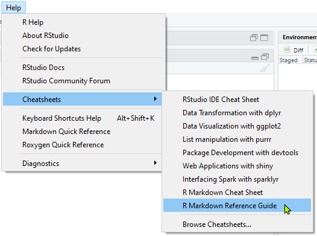
</center>

May the `knitr` be with you.


# R Session Info

```{r echo=FALSE, paged.print=FALSE}
devtools::session_info()
```

# Bibliography

